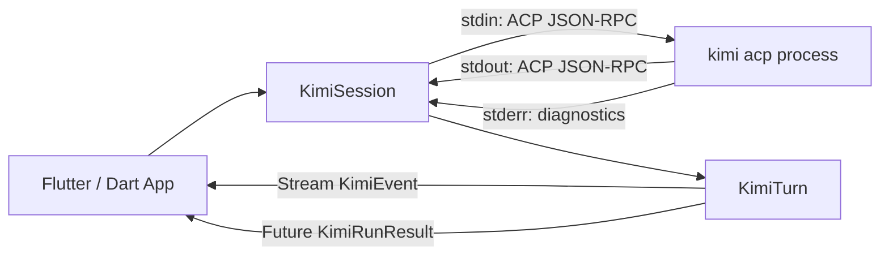

# Architecture

Dart/Flutter SDK that wraps the Kimi Code CLI as a child process, speaking the
Agent Client Protocol (ACP, JSON-RPC 2.0) over stdin/stdout via `kimi acp`.

## Components

## Source layout

| File | Responsibility |
|------|---------------|
| `lib/flutter_kimi_sdk.dart` | Barrel export |
| `lib/src/session.dart` | `KimiSession` + `KimiTurn` — process management, ACP handshake, event dispatch, permission handling |
| `lib/src/events.dart` | Sealed `KimiEvent` hierarchy — decoded from ACP `session/update` notifications |
| `lib/src/types.dart` | Value types: `ApprovalResponse`, `ApprovalOption`, `KimiTurnStatus`, `KimiRunResult`, `ContentKind` |
| `lib/src/errors.dart` | `KimiException` hierarchy with four categories: transport, protocol, session, cli |
| `tool/acp_smoke.dart` | End-to-end smoke test against a real `kimi` CLI |

## Key constraints

- **Desktop/server only** — requires `dart:io` `Process.start`. No iOS, Android, or web.
- **Single active turn** — `KimiSession` enforces one `KimiTurn` at a time; calling `prompt()` while active throws.
- **CLI version** — needs Kimi Code CLI 0.22+ (the `acp` subcommand). The legacy `--wire` protocol supported before SDK 0.3.0 no longer exists in the CLI.
- **Only dependency** — `package:meta` (for `@visibleForTesting`).
