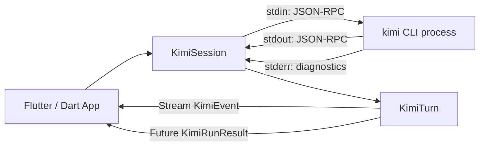

# Architecture

Dart/Flutter SDK that wraps the Kimi Code CLI as a child process, communicating over JSON-RPC on stdin/stdout.

## Components

## Source layout

| File | Responsibility |
|------|---------------|
| `lib/flutter_kimi_sdk.dart` | Barrel export |
| `lib/src/session.dart` | `KimiSession` + `KimiTurn` — process management, JSON-RPC framing, event dispatch |
| `lib/src/events.dart` | Sealed `KimiEvent` hierarchy — one class per wire notification type |
| `lib/src/types.dart` | Value types: `ApprovalResponse`, `KimiTurnStatus`, `KimiRunResult`, `ContentKind` |
| `lib/src/errors.dart` | `KimiException` hierarchy with four categories: transport, protocol, session, cli |

## Key constraints

- **Desktop/server only** — requires `dart:io` `Process.start`. No iOS, Android, or web.
- **Single active turn** — `KimiSession` enforces one `KimiTurn` at a time; calling `prompt()` while active throws.
- **Wire protocol version** — SDK announces `1.7` by default; override via `protocolVersion` parameter.
- **Only dependency** — `package:meta` (for `@visibleForTesting`).
