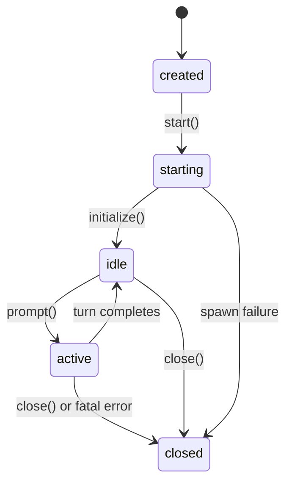

# Session Lifecycle

`KimiSession` manages the `kimi acp` child process and enforces a strict state
machine.

## States



| State | Meaning | Allowed calls |
|-------|---------|--------------|
| `created` | Constructed but not spawned | — (internal only) |
| `starting` | Process spawned, awaiting handshake | `initialize()` |
| `idle` | Ready for prompts | `prompt()`, `close()` |
| `active` | A turn is in flight | `turn.approve()`, `turn.interrupt()`, `close()` |
| `closed` | Terminal — process exited or explicitly closed | — |

## Startup sequence

```dart
final session = await KimiSession.start(
  workDir: '/path/to/project',
  yoloMode: true,
);
await session.initialize(); // full ACP handshake, waits up to 15s total
```

`start()` spawns `kimi acp` and wires up stdout/stderr listeners.
`initialize()` performs the handshake — ACP `initialize`, then `session/new`
(or `session/load` when `sessionId:` was passed), then applies `model` /
`thinking` / `yoloMode` via `session/set_config_option`. If the CLI doesn't
finish within `timeout` (default 15s), a `KimiTransportException` is thrown
with any buffered stderr for diagnosis (missing binary, pre-0.22 CLI). CLI
rejections (bad model, not logged in — run `kimi login`) throw
`KimiCliException`. The result map's `configOptions` lists available models,
thinking levels, and modes; `session.acpSessionId` is set afterwards.

## Shutdown

`close()` closes stdin, waits up to 5s for the process to exit, then escalates
through SIGTERM → SIGKILL. Always call `close()` (use try/finally) to avoid
orphaned CLI processes.

## Multi-turn and resume

After a turn completes (state returns to `idle`), call `prompt()` again — the
CLI maintains conversation context within the session. Across process
restarts, pass `sessionId: previous.acpSessionId` to `KimiSession.start` to
resume the conversation via ACP `session/load`.
