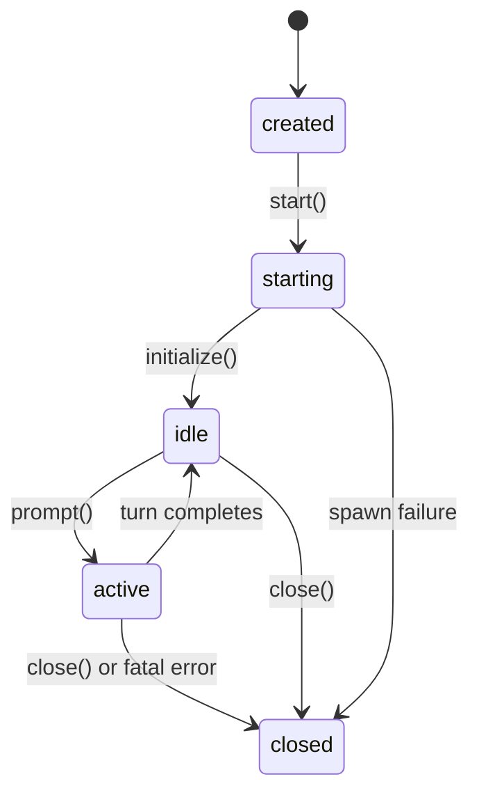

# Session Lifecycle

`KimiSession` manages the `kimi` CLI child process and enforces a strict state machine.

## States



| State | Meaning | Allowed calls |
|-------|---------|--------------|
| `created` | Constructed but not spawned | — (internal only) |
| `starting` | Process spawned, awaiting `initialize` response | `initialize()` |
| `idle` | Ready for prompts | `prompt()`, `close()` |
| `active` | A turn is in flight | `turn.approve()`, `turn.interrupt()`, `close()` |
| `closed` | Terminal — process exited or explicitly closed | — |

## Startup sequence

```dart
final session = await KimiSession.start(
  workDir: '/path/to/project',
  model: 'kimi-k2-thinking-turbo',
  yoloMode: true,
);
await session.initialize(); // sends JSON-RPC initialize, waits up to 15s
```

`start()` spawns the process and wires up stdout/stderr listeners. `initialize()` performs the handshake — if the CLI doesn't respond within `timeout` (default 15s), a `KimiTransportException` is thrown with any buffered stderr for diagnosis (missing binary, bad credentials, version mismatch).

## Shutdown

`close()` closes stdin, waits up to 5s for the process to exit, then escalates through SIGTERM → SIGKILL. Always call `close()` (use try/finally) to avoid orphaned CLI processes.

## Multi-turn

After a turn completes (state returns to `idle`), call `prompt()` again. The CLI maintains conversation context across turns within the same session.
