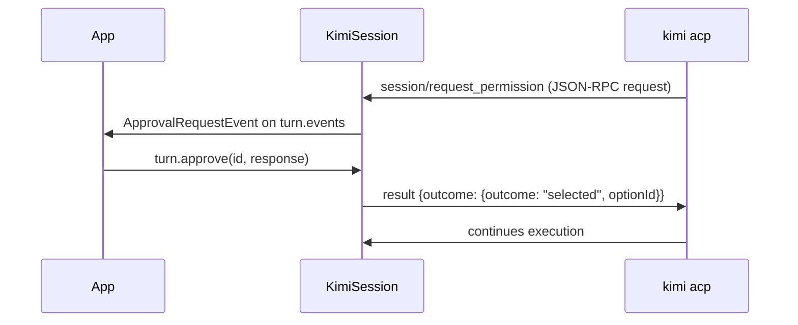

# Tool Approvals

When `yoloMode: false`, the Kimi CLI asks the SDK to approve tool calls before
executing them via ACP `session/request_permission`. The SDK surfaces these as
`ApprovalRequestEvent` instances on the turn's event stream.

## Flow

## ApprovalRequestEvent fields

- `id` — pass back to `turn.approve()` as the first argument
- `toolCallId` — which tool call needs approval
- `sender` — tool title (e.g. `Bash`, `WriteFile`)
- `description` — human-readable detail (e.g. ``Requesting approval to Running: ls -la``)
- `options` — the `ApprovalOption` list the CLI offered (`optionId`, `name`, `kind`)

## ApprovalResponse values

`turn.approve()` selects the offered option whose `kind` matches:

| Value | ACP option kind | Effect |
|-------|-----------------|--------|
| `approve` | `allow_once` | Allow this single tool call |
| `approveForSession` | `allow_always` | Allow this and all similar calls for the session |
| `reject` | `reject_once` (falls back to `reject_always`) | Block the tool call |

If the CLI didn't offer a matching option, `approve()` throws a
`KimiSessionException('NO_MATCHING_OPTION')` — inspect `event.options` and
build custom UI for nonstandard option sets.

## yoloMode

When `yoloMode: true` is passed to `KimiSession.start()`, the SDK sets the
session mode to `yolo` (CLI auto-approves) and, belt-and-braces, auto-answers
any permission request that still arrives with the best `allow` option — no
`ApprovalRequestEvent` is ever emitted. Use only for demos or trusted
environments.
