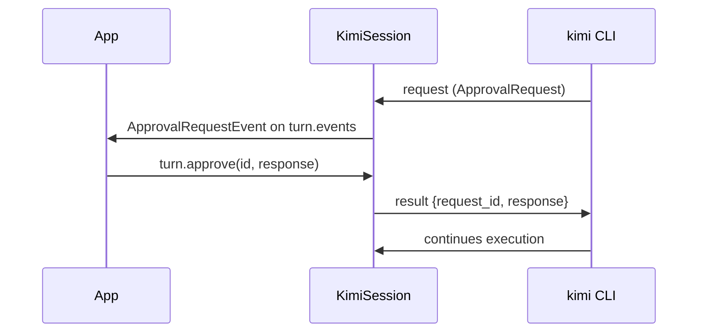

# Tool Approvals

When `yoloMode: false`, the Kimi CLI asks the SDK to approve tool calls before executing them. The SDK surfaces these as `ApprovalRequestEvent` instances on the turn's event stream.

## Flow

## ApprovalRequestEvent fields

- `id` — pass back to `turn.approve()` as the first argument
- `toolCallId` — which tool call needs approval
- `sender` — tool name (e.g. `Shell`, `WriteFile`)
- `action` — short phrase (e.g. `run shell command`)
- `description` — human-readable detail (e.g. `` Run command `ls -la` ``)

## ApprovalResponse values

| Value | Wire string | Effect |
|-------|-------------|--------|
| `approve` | `"approve"` | Allow this single tool call |
| `approveForSession` | `"approve_for_session"` | Allow this and all similar calls for the session |
| `reject` | `"reject"` | Block the tool call |

An optional `reason` string can be passed as a third argument to `turn.approve()`.

## yoloMode

When `yoloMode: true` is passed to `KimiSession.start()`, the CLI auto-approves all tool calls and no `ApprovalRequestEvent` events are emitted. Use only for demos or trusted environments.
